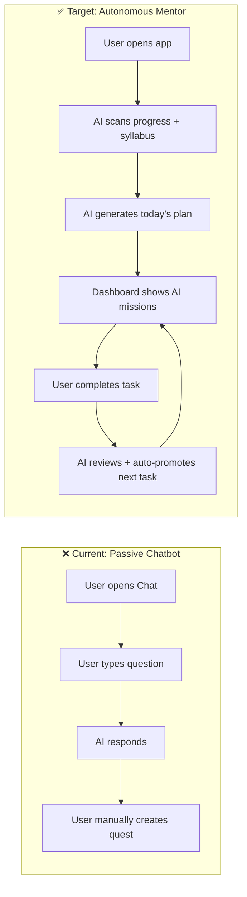
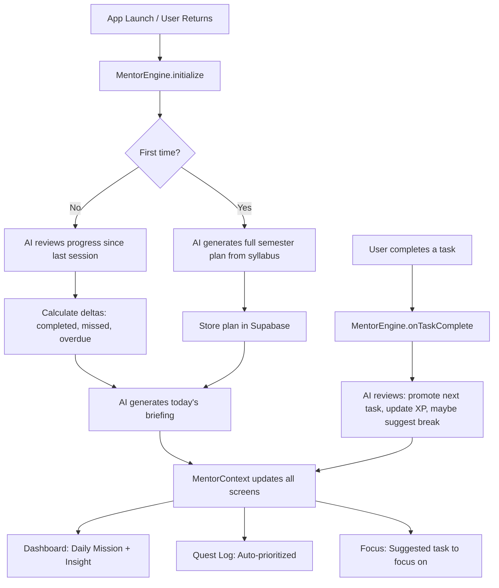
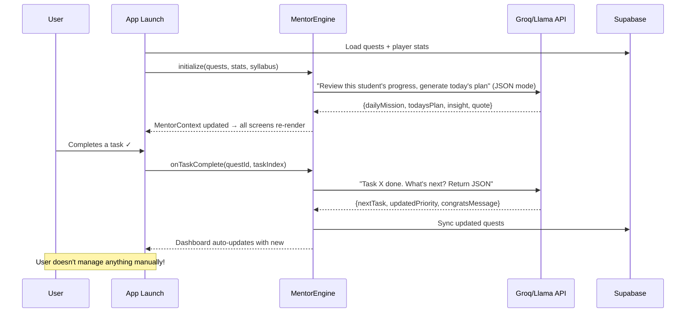

# AI Mentor Integration Plan — "The Oracle" Becomes Your Sensei

> Transform the AI from a **passive chatbot** into an **autonomous mentor** that drives every screen, auto-generates tasks, reviews completions, and manages the user's entire study path.

---

## Current State vs Target State



---

## Architecture Overview



---

## Proposed Changes

### Phase 1: AI Mentor Engine (Core Brain)

The central service that makes all AI decisions.

#### [NEW] [mentorService.ts](file:///c:/Users/aayan/OneDrive/Desktop/study/4th-sem-weapon/src/services/mentorService.ts)

The core AI brain. Key functions:

| Function | Trigger | What it does |
|---|---|---|
| `generateDailyBriefing()` | App open / login | Scans all quests + progress → AI generates today's priority order, daily mission, insight card, and motivational quote |
| `generateSemesterPlan()` | First login / recalibrate | Takes syllabus data → AI creates a full quest tree with chapters, deadlines, XP values |
| `onTaskComplete()` | User checks off a task | AI reviews completion → auto-promotes next task to "Daily Mission" → may suggest a break or switch topic |
| `onSessionStart()` | App foreground | Checks days missed → if gap, triggers recalibration with context-aware catch-up plan |
| `getInsightForScreen()` | Any screen load | Returns a screen-specific AI tip (e.g., "Focus on OS Unit 3 — high-weightage, low-effort") |

Each function calls the Groq/Llama API with structured prompts that return **JSON**, not chat text. The AI responds with actionable data structures that directly update the UI.

#### [NEW] [MentorContext.tsx](file:///c:/Users/aayan/OneDrive/Desktop/study/4th-sem-weapon/src/context/MentorContext.tsx)

Global React context that wraps the entire app. Provides:

```typescript
interface MentorState {
  dailyMission: Quest | null;         // AI-chosen #1 priority
  todaysPlan: QuestTask[];            // Ordered list of today's tasks
  systemInsight: InsightCard;         // AI strategic tip for dashboard
  focusSuggestion: FocusTarget;       // What to study next in Focus screen
  mentorMessage: string;              // Motivational quote / status
  isProcessing: boolean;             // Show oracle animation
  lastReviewTime: Date;              // When AI last reviewed
}
```

- **On mount**: calls `mentorService.generateDailyBriefing()`
- **On task toggle**: calls `mentorService.onTaskComplete()` → auto-updates priority order
- **On app resume**: calls `mentorService.onSessionStart()` → checks for missed days

---

### Phase 2: Smart Dashboard (AI Drives the Home Screen)

#### [MODIFY] [DashboardScreen.tsx](file:///c:/Users/aayan/OneDrive/Desktop/study/4th-sem-weapon/src/screens/DashboardScreen.tsx)

**Current**: Static "System Insight" card + first quest = daily mission.
**New**: Everything comes from `MentorContext`:

- **System Insight card** → AI-generated each session (dynamic, context-aware)
- **Daily Mission** → AI picks the highest-priority incomplete task, not just `quests[0]`
- **Side Quests** → AI-ordered by urgency (deadline, difficulty, exam proximity)
- **Motivational quote** → AI-generated based on streak/progress
- **Mentor greeting** → "Welcome back, Seeker. You completed 3 tasks yesterday. Today's focus: OS Unit 3."

#### [MODIFY] [QuestLogScreen.tsx](file:///c:/Users/aayan/OneDrive/Desktop/study/4th-sem-weapon/src/screens/QuestLogScreen.tsx)

- Quests auto-sorted by AI priority (not manual order)
- When a task is completed → AI immediately re-evaluates and may:
  - Promote the next sub-task to the top
  - Complete the quest and start the next one
  - Suggest a focus break
- Add "Recalibrate" button → triggers `mentorService.onSessionStart()` with force flag

#### [MODIFY] [FocusScreen.tsx](file:///c:/Users/aayan/OneDrive/Desktop/study/4th-sem-weapon/src/screens/FocusScreen.tsx)

- Pre-populate with AI's suggested focus task (from `MentorContext.focusSuggestion`)
- After focus session ends → AI auto-marks the task as complete and promotes next one

---

### Phase 3: Auto-Quest Management (AI Creates & Manages Quests)

#### [MODIFY] [QuestContext.tsx](file:///c:/Users/aayan/OneDrive/Desktop/study/4th-sem-weapon/src/context/QuestContext.tsx)

Add new capabilities:

```typescript
// New functions in QuestContext
completeTask(questId, taskIndex)  → AI reviews → auto-promote next
removeQuest(questId)              → AI cleans up and recalculates plan
replaceAllQuests(quests[])        → Used by AI when generating full plan
reorderByPriority(orderedIds[])   → AI-driven reordering
```

#### [MODIFY] [knowledgeService.ts](file:///c:/Users/aayan/OneDrive/Desktop/study/4th-sem-weapon/src/services/knowledgeService.ts)

- Expand from hardcoded Cyber Security only → load all 4th semester subjects dynamically
- Structure: each subject has syllabus + notes + PYQ data
- This data feeds the AI when generating semester plans

#### [MODIFY] [aiService.ts](file:///c:/Users/aayan/OneDrive/Desktop/study/4th-sem-weapon/src/services/aiService.ts)

Add new structured prompt functions:

| Function | Returns |
|---|---|
| `generateStructuredPlan(syllabus)` | Full quest array with tasks, XP, deadlines |
| `reviewAndReprioritize(quests, completedTask)` | Updated priority order + insight |
| `generateDailyInsight(quests, stats)` | Insight card object |
| `suggestFocusTarget(quests)` | Single task to focus on |

All use **JSON-mode responses** — the AI returns parseable data, not chat text.

---

### Phase 4: Remaining Screens (Priority Order)

> [!NOTE]
> Only screens that align with the AI mentor system. Onboarding and conflicting screens are excluded.

#### [NEW] [OracleProcessingScreen.tsx](file:///c:/Users/aayan/OneDrive/Desktop/study/4th-sem-weapon/src/screens/OracleProcessingScreen.tsx)

Animated loading screen shown while AI processes:
- Pulsing circle animation, "Consulting the Oracle" text
- Fake log feed (timestamps + processing steps)
- Progress bar, data node counter
- Used during: initial plan generation, recalibration, major reviews

#### [NEW] [SystemRecalibrationScreen.tsx](file:///c:/Users/aayan/OneDrive/Desktop/study/4th-sem-weapon/src/screens/SystemRecalibrationScreen.tsx)

Triggered when AI detects missed days or user requests recalibration:
- Shows "You missed X days. Recalculating optimal path..."
- AI-suggested daily missions list
- "Accept Path" → applies AI plan
- "Reject & Customize" → opens CustomizePath

#### [NEW] [CustomizePathScreen.tsx](file:///c:/Users/aayan/OneDrive/Desktop/study/4th-sem-weapon/src/screens/CustomizePathScreen.tsx)

Manual override for AI suggestions:
- Drag-to-reorder mission list
- Show estimated load (mins) and total XP
- "Finalize Path" → saves override, AI respects user's order going forward

#### [NEW] [TopicDetailScreen.tsx](file:///c:/Users/aayan/OneDrive/Desktop/study/4th-sem-weapon/src/screens/TopicDetailScreen.tsx)

Drill-down into any task/topic:
- Confidence status (Not Started / Studying / Mastered)
- Progress bar
- Linked resources (video, PDF, quiz)
- AI "Zen Tip" for the specific topic

---

### Phase 5: App.tsx & Navigation Updates

#### [MODIFY] [App.tsx](file:///c:/Users/aayan/OneDrive/Desktop/study/4th-sem-weapon/App.tsx)

- Wrap app with `<MentorProvider>` (inside [QuestProvider](file:///c:/Users/aayan/OneDrive/Desktop/study/4th-sem-weapon/src/context/QuestContext.tsx#88-222))
- Add new stack screens: `OracleProcessing`, `SystemRecalibration`, `CustomizePath`, `TopicDetail`
- Remove or repurpose the `Upload` tab → replace with [Focus](file:///c:/Users/aayan/OneDrive/Desktop/study/4th-sem-weapon/src/screens/FocusScreen.tsx#16-245) in the tab bar

---

## The AI Mentor Lifecycle



---

## Screens NOT Being Built (Excluded)

| Design | Reason |
|---|---|
| [the_awakening_screen.png](file:///c:/Users/aayan/OneDrive/Desktop/study/screen/the_awakening_screen.png) | Onboarding — can add later, not core to AI mentor |
| [quest_line_initialization_screen.png](file:///c:/Users/aayan/OneDrive/Desktop/study/screen/quest_line_initialization_screen.png) | Part of onboarding flow |
| [goal_alignment_screen.png](file:///c:/Users/aayan/OneDrive/Desktop/study/screen/goal_alignment_screen.png) | Part of onboarding flow |
| [final_calibration_screen.png](file:///c:/Users/aayan/OneDrive/Desktop/study/screen/final_calibration_screen.png) | Part of onboarding flow |
| [pyq_vault_screen.png](file:///c:/Users/aayan/OneDrive/Desktop/study/screen/pyq_vault_screen.png) | Separate feature, not AI-mentor critical |
| [pyq_vault_ai_data_sync_screen.png](file:///c:/Users/aayan/OneDrive/Desktop/study/screen/pyq_vault_ai_data_sync_screen.png) | Visual variant of PYQ vault |
| [add_pyq_modal_screen.png](file:///c:/Users/aayan/OneDrive/Desktop/study/screen/add_pyq_modal_screen.png) | Depends on PYQ vault |
| [add_resource_modal_screen.png](file:///c:/Users/aayan/OneDrive/Desktop/study/screen/add_resource_modal_screen.png) | Can add later |
| [reorder_animation_preview_screen.png](file:///c:/Users/aayan/OneDrive/Desktop/study/screen/reorder_animation_preview_screen.png) | Visual variant of CustomizePath (covered) |
| [generated_screen_screen.png](file:///c:/Users/aayan/OneDrive/Desktop/study/screen/generated_screen_screen.png) | Simple success animation, can add as part of CustomizePath flow |

---

## Verification Plan

### Automated Testing
- Test `mentorService` functions with mocked AI responses
- Verify quest auto-promotion: complete task → next task becomes daily mission

### Manual Testing
1. Fresh login → AI generates full study plan (show Oracle Processing screen)
2. Complete a task → watch dashboard auto-update with new #1 priority
3. Miss 2 days → trigger recalibration flow
4. Override AI order → customize path → verify AI respects override

> [!IMPORTANT]
> The key architectural change: `MentorContext` sits above [QuestContext](file:///c:/Users/aayan/OneDrive/Desktop/study/4th-sem-weapon/src/context/QuestContext.tsx#24-32) and **actively mutates quests** based on AI decisions. The user never manually prioritizes — the AI does it all.
